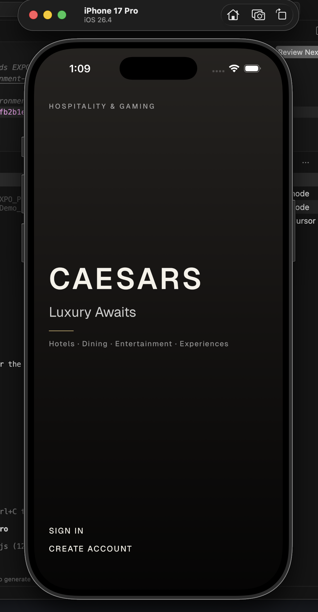

# Hospitality — LaunchDarkly demo app

A small **hospitality-themed** mobile experience used to demonstrate **LaunchDarkly** feature flags, **multi-context targeting**, and **Observability** in a realistic client app. The project is a **monorepo**: Expo + React Native for the app, an optional Hono API, and shared TypeScript types.

## Tech stack

| Area | Technologies |
|------|----------------|
| **Mobile** | [Expo](https://expo.dev/) (SDK 54), **React Native**, **React 19**, **TypeScript**, [Expo Router](https://docs.expo.dev/router/introduction/) |
| **Feature flags & observability** | [LaunchDarkly React Native SDK](https://docs.launchdarkly.com/sdk/client-side/react/react-native), [LaunchDarkly Observability for React Native](https://docs.launchdarkly.com/home/observability) |
| **Backend (optional)** | Node.js, [Hono](https://hono.dev/), TypeScript, [`tsx`](https://github.com/privatenumber/tsx) |
| **Shared code** | `packages/shared` — types and shapes used by mobile and server |
| **Repo layout** | npm **workspaces** (`mobile`, `server`, `packages/shared`) |

Root scripts:

- `npm run dev:mobile` — start the Expo app (`mobile`)
- `npm run dev:server` — start the mock API (`server`, port `8787` by default)

## UI screenshots

Screens from the app live in [`mobile/src/images/`](mobile/src/images/).

| | |
|:--|:--|
|  | .png) |
| .png) | .png) |
| .png) | |

## What this demo is for

The app is intentionally **thin on “real” backend logic** so you can focus on **flag-driven UX**, **rich evaluation context**, and **telemetry**. Below is what the codebase is set up to showcase when paired with a LaunchDarkly project.

### Demo users and local auth

- **Default path (`EXPO_PUBLIC_LOCAL_DEMO_AUTH=true`)**: sign-in does **not** call your server. Any non-empty email and password creates an on-device session so **LaunchDarkly still receives identifiable user + organization context** after login.
- **Predefined “switch user” profiles**: if the email matches a demo profile, the app merges **hospitality traits** (tier, lifetime spend, reward points, bookings, beta flag, location, etc.) into the session — useful for **rules-based targeting** in LaunchDarkly instead of anonymous traffic.

Example emails (see [`mobile/src/data/demoContent.ts`](mobile/src/data/demoContent.ts) for the full list):

| Profile | Email (local demo) |
|---------|-------------------|
| Platinum guest | `alexandra.chen@demo.local` |
| Gold / beta | `james.morrison@demo.local` |
| Silver / new | `sofia.rodriguez@demo.local` |
| Guest | `guest@caesars.com` |

Use the in-app **Switch user** flow to pick a persona quickly; traits flow into **multi-context** identify (user, organization, device) via [`LDIdentifyBridge`](mobile/src/context/LDIdentifyBridge.tsx) and [`buildLaunchDarklyContext`](mobile/src/lib/ld/buildContext.ts).

### Feature flags used in the UI

Create **boolean** flags in the **same LaunchDarkly environment** as your mobile SDK key. Keys are defined in [`mobile/src/lib/ld/flags.ts`](mobile/src/lib/ld/flags.ts):

| Flag key | When ON | Purpose in the demo |
|----------|---------|----------------------|
| `demo-home-feature` | **Home** shows the “Elevate Rewards” promo banner and gradient treatment | Safe, visible **UI toggle** for stakeholders |
| `demo-bookings-calendar` | **Bookings** shows the “Trip calendar” entry → navigates to [`/bookings/calendar`](mobile/app/bookings/calendar.tsx) | **Observability** path: intentional failure + spans/attributes so you can inspect errors, logs, and metrics (and session correlation when enabled in your LD project) |

### Targeted release (who sees a flag)

Evaluation uses **multi-context** (user, organization, device) with hospitality-oriented attributes. In the LaunchDarkly UI you can target by:

- **User** traits (e.g. membership tier, beta user, spend, tenure)
- **Organization** (demo org id/plan/region)
- **Device** / session hints wired in code

That supports **segmented releases** — e.g. beta users only, specific orgs, or high-value guests — without separate app builds.

### Rollback and “guarded” rollouts

The demo does not implement its own rollout engine; **LaunchDarkly does**. Typical patterns this app is meant to pair with:

- **Instant rollback**: turn a boolean flag **off** (or move everyone to the “off” variation) to revert UI immediately — no app store release required.
- **Guarded / gradual rollout**: use **percentage rollouts**, **targeting rules**, or **scheduled changes** in LaunchDarkly to limit blast radius, then expand or roll back from the flag dashboard.
- **Kill switch**: the same flags act as a **kill switch** for the promo and calendar entry if something misbehaves in production.

### Observability

The calendar demo screen documents an **intentional error path** so **LaunchDarkly Observability** can receive correlated errors, logs, and traces. Configure Observability and (optionally) session replay in your **LaunchDarkly project**, not only in this repo. See comments in [`mobile/.env.example`](mobile/.env.example) and [`mobile/src/lib/ld/client.ts`](mobile/src/lib/ld/client.ts).

### Code references

Flag keys are aliased for **LaunchDarkly code references** (e.g. GitHub Action) in [`.launchdarkly/coderefs.yaml`](.launchdarkly/coderefs.yaml) so usage outside `flags.ts` is visible in the LD UI.

## Configuration

Copy [`mobile/.env.example`](mobile/.env.example) to `mobile/.env` and/or `mobile/.env.local`, set **`EXPO_PUBLIC_LAUNCHDARKLY_MOBILE_KEY`**, create the two boolean flags above, then restart Expo.

For optional beta targeting by email list, see `EXPO_PUBLIC_LD_BETA_EMAILS` in `.env.example`.

## Repository layout

```
mobile/           Expo + React Native app
server/           Optional Hono mock API (when local demo auth is off)
packages/shared/  Shared TypeScript types
```

---

This repository is for **demos and learning**; it is not a production hospitality platform.
